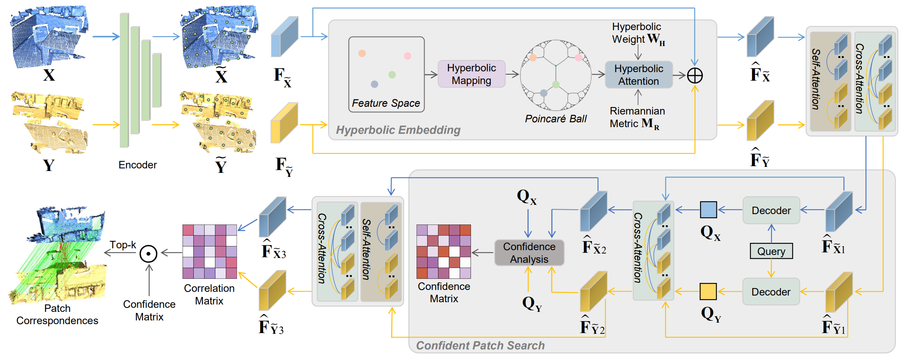

# HECPG: Hyperbolic Embedding and Confident Patch-Guided Network for Point Cloud Matching (TGRS 2023)
PyTorch implementation of the paper:
[HECPG: Hyperbolic Embedding and Confident Patch-Guided Network for Point Cloud Matching](https://ieeexplore.ieee.org/document/10445523).




## Environment and Data Preparation
<!-- Our model is trained with the following environment:
- Ubuntu 20.04
- Python 3.8
- PyTorch 1.8.1 with torchvision 0.9.1 (Cuda 11.1)
Other required packages can be found in ```requirements.txt```. -->
The codes of our project mainly base on [GeoTransformer](https://github.com/qinzheng93/GeoTransformer), please follow it.
<!-- ## Dataset Preparation -->


## Usage

To train a model:
```
python trainval.py
```

To test a model:
```
python test.py --snapshot=weights_path --benchmark=3DMatch
python eval.py --benchmark=3DMatch --method=ransac
```


## Citation
If you find our work useful in your research, please consider citing:
```latex
@article{xie2024hecpg,
  title={HECPG: Hyperbolic Embedding and Confident Patch-Guided Network for Point Cloud Matching},
  author={Xie, Yifan and Zhu, Jihua and Li, Shiqi and Hu, Naiwen and Shi, Pengcheng},
  journal={IEEE Transactions on Geoscience and Remote Sensing},
  year={2024},
  volume={62},
  number={},
  pages={1-12},
  publisher={IEEE}
}
```

### Acknowledgement
This code is developed heavily relying on [GeoTransformer](https://github.com/qinzheng93/GeoTransformer), [PREDATOR](https://github.com/prs-eth/OverlapPredator) and [hyp-ViT](https://github.com/htdt/hyp_metric). Thanks for these great projects.